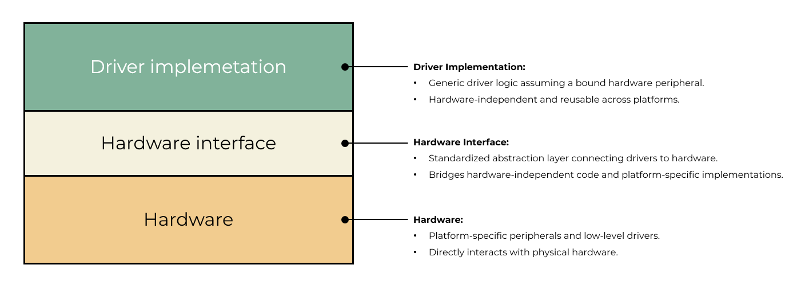

# Lite Driver - Peripheral Library Framework

A lightweight and portable peripheral library framework designed for embedded systems.

## Overview

  

This repository provides a collection of peripheral libraries implemented in **pure C**, following **hardware abstraction** and **object-oriented design principles**.  
The goal is to help developers build scalable, maintainable, and reusable embedded software across different hardware platforms.

## Design Principles

- **Pure C implementation**  
  No C++ dependency, suitable for resource-constrained microcontrollers.

- **Hardware Abstraction Layer (HAL-like architecture)**  
  Clear separation between hardware-dependent and hardware-independent code.

- **Object-Oriented Design in C**  
  Encapsulation through structures, function pointers, and well-defined interfaces.

- **High Portability**  
  Easily portable across different MCU families and architectures.

- **Clean and Modular Codebase**  
  Each peripheral is designed as an independent module.

## Key Features

- Unified interface for peripheral drivers
- Platform-independent core logic
- Minimal platform-specific adaptation
- Easy integration into existing projects
- Designed for long-term maintainability

## Supported Use Cases

- Embedded firmware development
- Multi-platform product development
- Rapid prototyping and porting
- Educational and training purposes

## Porting Guide

1. Implement low-level hardware access functions
2. Bind platform-specific drivers to the abstract interface
3. Reuse the same application-level code across platforms
